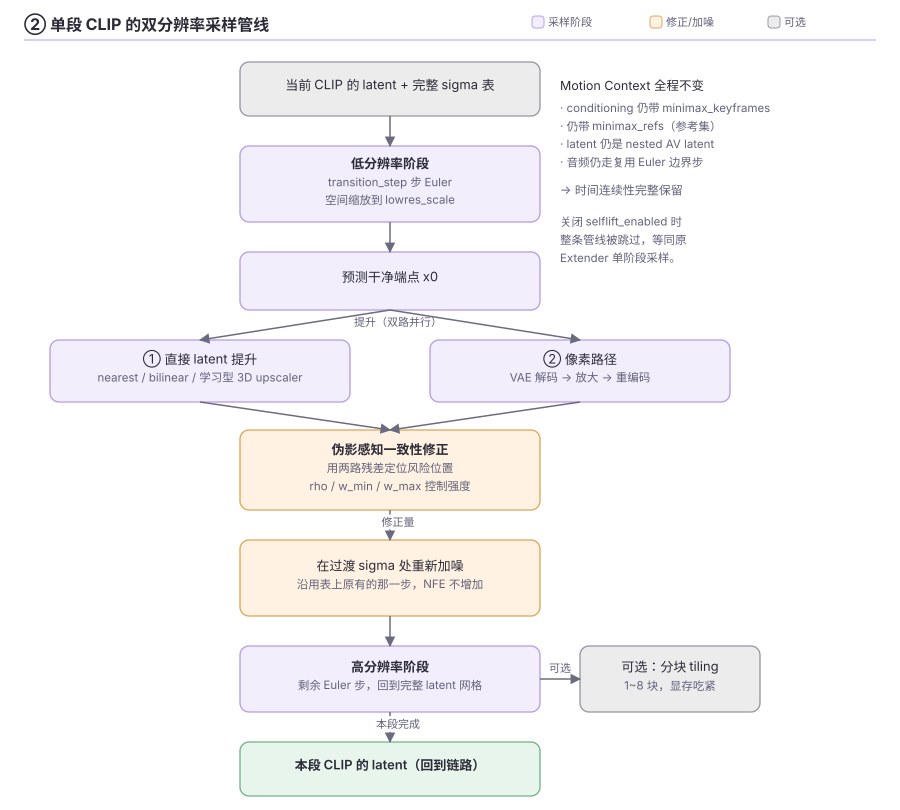
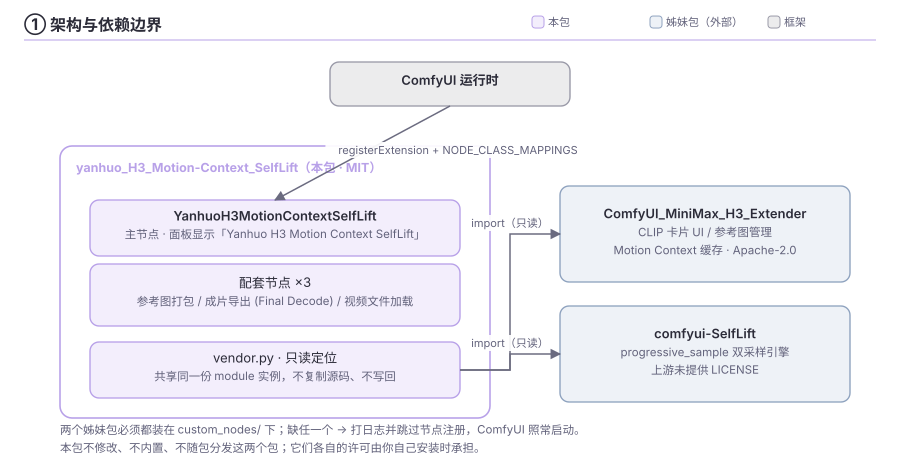
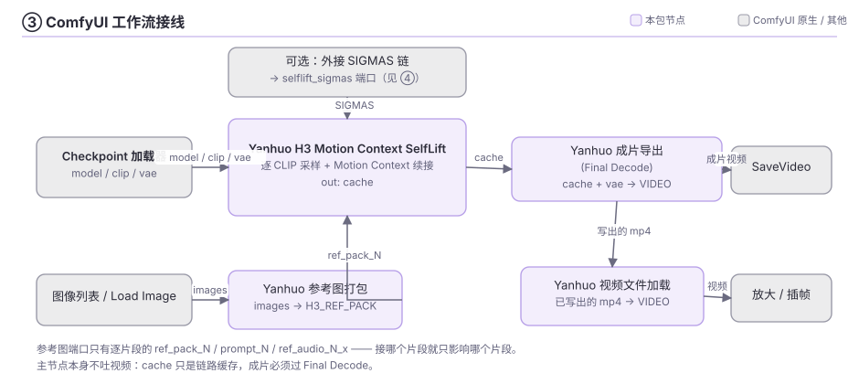
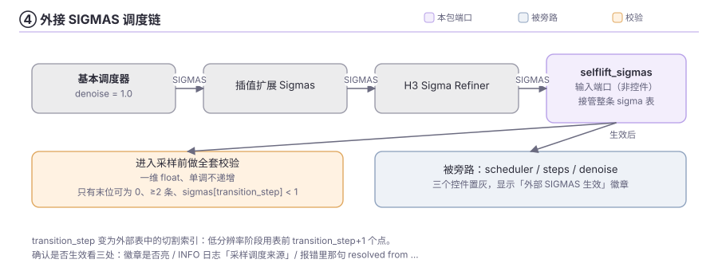
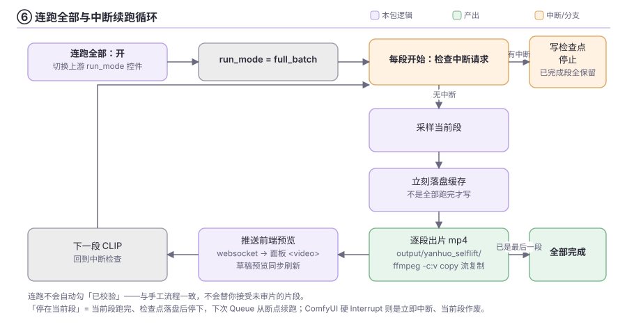
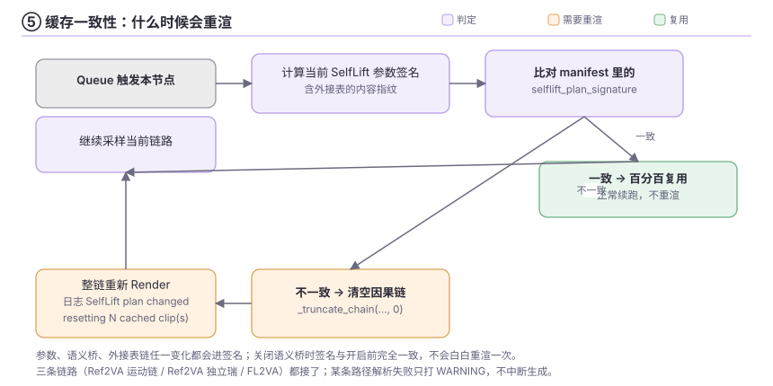

# yanhuo_H3_Motion-Context_SelfLift

把 **MiniMax H3 Extender 的 Motion Context 续接能力** 和 **SelfLift 双分辨率采样** 合进同一个节点：
一次 Queue 按 CLIP 片段连续出片，段间保留 Motion Context 的时间连续性，同时用低分辨率前缀换速度、
用一致性修正补画质。

- 节点名：`YanhuoH3MotionContextSelfLift`
- 面板显示：**Yanhuo H3 Motion Context SelfLift**（分类 `MiniMax H3/SelfLift`）

> 本包**不修改** `ComfyUI_MiniMax_H3_Extender`，也**不修改** `comfyui-SelfLift`。
> 它以只读方式 import 这两个姊妹包，只在「怎么采样」这一层做桥接——上游更新不会和本包冲突。

---

## 特性一览

| | |
|---|---|
| **双分辨率采样** | 低分辨率 Euler 前缀 → 干净端点预测 → 伪影感知一致性提升 → 高分辨率 Euler 后缀 |
| **Motion Context 完整保留** | conditioning 仍带 `minimax_keyframes` / `minimax_refs`，latent 仍是 Extender 的 nested AV latent，音频仍走复用 Euler 边界步 |
| **外接 SIGMAS** | 可选 `selflift_sigmas` 端口，把整条 sigma 调度表交给外部链接管 |
| **二采专用模型** | 可选 `model_hires` 端口：一采（低分辨率）用 `model`、二采（高分辨率）另外挂一个 checkpoint/LoRA，起草与精修分开 |
| **条件卡提示词只读/编辑** | 卡片提示词默认只读（跟随 `prompt_N` 端口）；点「编辑」后本次运行改用卡片里改过的文本，端口值不再覆盖 |
| **内置语义桥** | 可选蒸馏 MLP，缓解复杂动作里的语义错乱（默认关闭） |
| **面板内预览** | 草稿视频逐帧预览 + 逐段成片实时播放，不用等全部跑完 |
| **连跑全部** | 一键切到上游 `run_mode=full_batch`，可随时停在当前段并从断点续跑 |
| **逐段出片** | 每采样完一段立刻拼出一条 mp4（FFV1 无损时为 mkv），边跑边看 |
| **逐段输入集合** | 把 32 组逐段端口（参考图包/提示词/时长/参考音频）收进一个独立节点，主节点不再被卡片撑长 |
| **全局 LoRA / 全局种子** | 多片段批量出片时不用逐卡重复配置 |
| **配套节点** | 逐段输入集合、参考图打包、成片导出、视频文件加载 |
| **缓存一致性** | SelfLift 参数变化（含换二采模型）自动触发受影响片段重渲，不会吃到旧缓存 |
| **中文界面** | 控件/按钮/状态/提示全中文，淡紫主题 + 取色键换肤 |

---

## 安装

```bash
cd ComfyUI/custom_nodes
git clone https://github.com/yanhuoxunxianren/yanhuo_H3_Motion-Context_SelfLift.git
```

重启 ComfyUI。本包不引入额外的 pip 依赖，但**必须**先装好下面两个姊妹包。

---

## 依赖（必须都在 `custom_nodes/` 下）

| 包 | 提供什么 |
|---|---|
| `ComfyUI_MiniMax_H3_Extender` | CLIP 卡片 UI、参考图管理、Motion Context 因果缓存、Disk Join、项目存档 |
| `comfyui-SelfLift` | `progressive_sample` 双采样引擎、学习型 H3 latent upscaler、高分辨率分块 |

缺任一个，本包启动时会打日志并**跳过节点注册**（不会让 ComfyUI 起不来）。

---

## 它做了什么

每一段 CLIP（续接卡）不再是「一次性全分辨率采样」，而是走下面这条双分辨率管线：



**没有变的**：conditioning 里依然带 `minimax_keyframes`（前置尾帧锚点）和 `minimax_refs`，
latent 依然是 Extender 的 nested AV latent，音频流依然走复用 Euler 边界步 ——
**Motion Context 的时间连续性完整保留**。

### 架构与依赖边界

本包**只 import，不修改、不内置、不随包分发**这两个姊妹包：



> 完整 6 张原理图（架构边界 / 采样管线 / 工作流接线 / 外接 SIGMAS 链 / 缓存决策 / 连跑循环）
> 见 [`docs/diagrams.md`](docs/diagrams.md)，同时提供 Mermaid 源码与 SVG 图片。

---

## 快速上手

最小接线（REF2VA 运动链）：

```
[Checkpoint 加载器] ──model/clip/vae──> Yanhuo H3 Motion Context SelfLift ──cache──> Yanhuo 成片导出 (Final Decode) ──> SaveVideo
```



1. 在主节点上填好 CLIP 1 的提示词、时长、参考图（需要多张参考图时，先用「参考图打包」节点）。
2. 用「+ 添加片段」加 CLIP 2、3……，每段勾「已校验」后 Queue 才会续接下一段。
3. 跑完后用「成片导出」拿到 mp4。

想一次跑完所有片段：打开工具栏的 **🔗 连跑全部**（见「连跑全部与中断续跑」）。

---

## 控件说明

在继承下来的 Extender 控件之外，追加了这些（位置在节点原生控件之后、自定义卡片面板之前）：

| 控件 | 默认 | 说明 |
|---|---|---|
| `selflift_enabled` | `true` | 关闭即完全等同原 Extender 单阶段采样 |
| `selflift_transition_step` | `2` | 低分辨率阶段步数，必须 `< steps`（合法 `1..steps-1`） |
| `selflift_lowres_scale` | `0.5` | 低分辨率空间缩放（论文 0.5），范围 0.25–1.0 |
| `selflift_rho` | `0.6` | 修正覆盖的最高风险位置比例；`0` 表示完全不用像素 VAE 锚点 |
| `selflift_w_min` / `selflift_w_max` | `1.0 / 1.0` | 修正强度下限/上限 |
| `selflift_latent_upsample` | `nearest` | 直接 latent 提升的插值方式 |
| `selflift_upscaler_model` | `none` | 外部学习型 H3 latent upscaler（`models/latent_upscale_models`）；选中后请把它当主提升路径，`rho` 设为 `0` |
| `selflift_upscaler_unload` | `true` | 提升完立刻把 upscaler 卸出显存（不影响结果） |
| `selflift_highres_tiling` | `false` | 高分辨率阶段空间自动分块（1–8 块），显存吃紧时开 |

### 追加的输入端口（插座，不是控件）

| 端口 | 类型 | 说明 |
|---|---|---|
| `selflift_sigmas` | `SIGMAS` | 外接调度表，见「外接 SIGMAS 调度」 |
| `model_hires` | `MODEL` | **二采专用模型**，可选。不接 → 一采/二采都用 `model`；接上 → 一采（低分辨率，定空间动作轮廓）用 `model`，二采（高分辨率，补细节）用 `model_hires`。常用来给二采单独挂一份 LoRA 或一个精修 checkpoint。接上后各条件卡的 LoRA 与全局 LoRA **只作用于一采**，不会渗进二采；拔掉才恢复「两阶段都吃条件卡 LoRA」。必须与 `model` 同架构同 latent 格式（都是 H3 系列）。 |
| `per_clip_inputs` | `H3_PER_CLIP_INPUTS` | **逐段输入集合**，可选。接「Yanhuo H3 逐段输入集合」节点（见下节）。不接 → 各条件卡用自己的卡片值（与以前不接 `prompt_N` / `ref_pack_N` 完全一样）。 |

> 两个端口都放在 `optional` 里（未连线完全可用、老工作流零影响）。
> 逐段端口之所以不再长在主节点上：32 张卡 × 4 个端口会把节点撑到看不见 `model/clip/vae`。

### 两套推荐起点

**A. SelfLift-zero（无外部权重，今天就能跑）**

```
steps=6~8   transition_step=3~4   lowres_scale=0.5
rho=0.6     w_min=1.0   w_max=1.0   upscaler_model=none
```

代价：每段多一次 VAE 解码→放大→重编码。`steps=4` 时基本没有加速收益，主要是画质/稳定性收益。

**B. 学习型 latent upscaler（需先把权重放进 `models/latent_upscale_models`）**

```
steps=8~16  transition_step=4~6   lowres_scale=0.5
rho=0.0     upscaler_model=<你的 h3 upscaler>   upscaler_unload=true
```

这条路跳过了完整的 VAE 往返，加速更接近理论值。显存不足再开 `selflift_highres_tiling`。

> 想要更强的段间稳定性，可以在 `model` 输入前串一个 SelfLift 自带的
> `H3 Temporal State Transport (TST)` 节点（tau=0.2），它是 MODEL→MODEL 补丁，与采样器无关。

### 步数与 `transition_step` 怎么算

`transition_step` 是**切在真实 sigma 调度表上的索引**，必须给高分辨率阶段留至少 1 步，
合法范围是 `1..总步数-1`。

- `有效步数` = `steps` 控件值，或外接表的 `条目数 - 1`；
- `高分辨率步数` = `有效步数 - transition_step`。

超出范围时**不会中断运行**，而是钳制到最后一个可用下标并打 WARNING（例如 4 步时 7 → 3，
即 3 步低分辨率 + 1 步高分辨率）。钳制发生在计算缓存签名之前，所以之后把 `steps` 提高到让原值
合法时，签名会跟着变、缓存会失效。

仍然会硬报错的是那些本包猜不出来的配置：`steps < 2`、模型不是 rectified-flow、
采样器不是 Euler、外接 sigma 表本身非法。

每次开跑的日志会打印
`schedule=widgets|external(N entries) steps=N | low X step(s) -> ... -> high Y step(s)`，
照这行就能确认低/高分辨率分配是不是你要的。

---

## 外接 SIGMAS 调度（`selflift_sigmas` 输入端口）

`selflift_sigmas` 是一个可选的 SIGMAS **输入端口**（不是控件）。未连接时一切照旧；
连接后整条 sigma 调度表由外部接管，典型接法：

```
[基本调度器] SIGMAS → [插值扩展Sigmas] → [H3 Sigma Refiner] → selflift_sigmas
```



接管后的行为与约束：

- `scheduler` / `steps` / `denoise` 三个控件被**完全旁路**（显示「外部 SIGMAS 生效」徽章并置灰）。
  denoise 裁剪必须在上游链完成（基本调度器 `denoise=1.0` 即可）。
- `transition_step` 语义变为**外部表中的切割索引**：低分辨率阶段用表前 `transition_step+1` 个点，
  其余走高分辨率。插入插值/精修步后要按新表重设。
- 进入采样前会做全套校验，不合法直接在 Queue 前报错：一维 float、单调不递增、
  **只有末位可为 0**、至少 2 个条目、`sigmas[transition_step] < 1`。
- σ[0] 请保持 `1.0`；σ[0] < 1 等于部分去噪，续接段首帧会欠噪。
- 低分辨率阶段吃的是表前缀，**别把前段排得太密**（前段过密 = 低分辨率阶段烧掉过多步）。
- 外部表的内容指纹（长度 + SHA-256）计入 `selflift_plan_signature`：改链不改参数也会正确触发整链重渲。
- 兼容性：H3 的 PDD 头部按 `sample_sigmas` 最近邻选头，音频 Euler 步也是查表走，外接表天然兼容；
  采样器仍必须是 Euler + `s_churn=0`。

**怎么确认这次有没有走外接**，看三处：

1. 节点上的 **「外部 SIGMAS 生效」徽章**：亮着即已生效，没看到就是没连上；
2. 每次运行的一行 INFO 日志：
   - `采样调度来源：外接 selflift_sigmas（N 条 -> M 步，切分 X 低分辨率 + Y 高分辨率）`
   - 或 `采样调度来源：节点控件 steps=… scheduler=… denoise=…（selflift_sigmas 未连接或为空）`
3. 报错里那句 `resolved from ...` —— 它说明这次步数是哪来的：
   - `resolved from \`steps\`=N with scheduler=..., denoise=...` → 走控件路径，外接表没生效；
   - `resolved from the external \`selflift_sigmas\` table (N entries -> M steps)` → 外接生效，
     步数由表决定，与 `steps` 控件无关。

---

## 内置语义桥（Semantic Bridge）

**不是 LoRA，也不改写提示词**。它是一个极小的蒸馏 MLP（`5120 → 512 → 512 → 5120`，SiLU，
约 22MB fp32），把 H3 第 49 层的语义表示往「老师模型」（SenseNova L32/L34）的语义空间拉一点，
用于减少复杂动作里的语义错乱：动作串人、武器/道具换主人、攻受关系混淆、
转身/换位/遮挡后人物关系丢失、后续动作从错误的前序状态继续。

```text
h = H3 conditioning [B, T, 5120]        # Qwen3-VL 编码后的文本条件
x = RMS_norm(h)                         # 逐 token 归一化，只留方向
p = MLP(x)
p = 幅值对齐(p, h)                       # per_token（官方推荐）/ global / none
hybrid = h + alpha * (p - h)            # alpha 推荐 0.10~0.15
```

它作用在 **H3 文本编码之后、采样之前**，挂在上游逐 CLIP 的 conditioning 构建函数之后，
因此**每个 CLIP N 都会自动生效**——不需要在工作流里插外挂节点，也不必重连 CONDITIONING 线。

| 控件 | 说明 |
|---|---|
| `selflift_bridge_enabled` | 语义桥开关，**默认关闭**（对既有工作流零影响） |
| `selflift_bridge_adapter` | 模型文件，读取 `ComfyUI/models/semantic_bridge` |
| `selflift_bridge_alpha` | 混合强度，默认 **0.10**（模型元数据建议 0.10~0.15） |
| `selflift_bridge_magnitude` | `per_token`（默认）/ `global` / `none` |

- 模型目录 `ComfyUI/models/semantic_bridge` 与 BUNNY / MiniMax_H3_Semantic_Bridge 两个插件共用，
  无需重复放置；
- 维度自动推断，fp32 计算后回写原始 dtype/device，模型带缓存、只占几十 MB；
- 开启后改模型/强度/对齐方式会自动让受影响片段重渲（进了缓存签名）；关闭时签名与开启前完全一致；
- 只在 REF2VA / FL2VA 的 conditioning 构建处生效；任何加载或应用异常只记日志，按原始
  conditioning 继续，绝不打断出片。

---

## 面板预览

### 草稿视频预览（采样过程）

开启 SelfLift 后，**每采样一步**都会把这一步的 x0 解成一张动画草稿，显示在节点面板工具栏下方，
并标注 `CLIP N · 步 x/y · 帧数 @ fps · 解码器`。不用外挂 Model Preview Override，
也不用手动改 `preview_frames`。

**帧数自动对齐当前 CLIP**：由当前 latent 的 token 数按 H3 的时间布局 `(1,4,4,4,4)`
（5 个 token = 17 帧）展开得到 —— 10s 片段 72 token → **243 帧**，7s 片段 52 token → **175 帧**。
所以 clip_by_clip 逐段跑、每段时长不同时，预览长度自动跟着变。

| 解码器 | 来源 | 说明 |
|---|---|---|
| `taeh3` | `models/vae_approx/taeh3.safetensors`（9.8MB 微型 VAE） | 接近真解，分块解码控制显存 |
| `Latent2RGB` | `latent_formats.MiniMaxH3Video.latent_rgb_factors` | 线性近似，零模型零显存，永远可用 |

无新增控件（FPS 24、显示宽 512、编码上限 480 帧均为默认）；预览任何异常都静默，绝不影响出片。

### 逐段成片实时预览（连跑时边跑边看）

每采样完一段 CLIP、逐段成片导出完成的瞬间，面板里直接出现一个 `<video>` 播放条
（草稿预览框下方），自动加载并播放最新一段成片，随后继续下一段采样——不再需要等整个节点跑完。

> 为什么不加输出端口：ComfyUI 的执行模型是「节点 return 之后输出端口才有数据」。
> 本节点要等所有 CLIP 采样完才 return，所以任何端口方案都只能在**全部结束后**把最后一段交给下游，
> 与「每段完成立刻播放」在模型上不相容，只有 websocket 推送一条路。

预览条带播放控件 + 「⬇ 下载本段」直链；走 ComfyUI 内置的 `/view` 端点，零自定义 HTTP 路由。

---

## 连跑全部与中断续跑



工具栏「载入项目」后面有 **「🔗 连跑全部：开/关」**，一键切换上游自带的 `run_mode` 控件
（`clip_by_clip` / `full_batch`）；旁边常驻 **「⏹ 停在当前段」**，直接调上游
`requestFullBatchInterrupt()`（上游的 `Interrupt` 按钮只在运行期间才出现，所以补一个常驻的）。

`full_batch` 本身就是「一次 Queue 依次生成全部片段」：

- 每段开始/结束都检查中断请求；
- 每段采样完立刻落盘缓存（不是全部跑完才写），随时停下都不丢；
- Interrupt 会写可续跑的检查点，下次 Queue 从断点继续。

**打断**：点「⏹ 停在当前段」→ 当前片段跑完、检查点落盘后停下，已完成片段全部保留，
下次 Queue 从断点续跑。ComfyUI 的硬 Interrupt 也能用，但那是立即中断，当前段作废。

**注意**：连跑**不会**自动勾「已校验」——与手工流程一致，不会替你接受未审片的片段。
全部跑完后用成片导出检查，不满意的单卡取消「已校验」重跑。

### 逐段出片

开启连跑后，每采样完一个 CLIP N，立即把当前链路（第 1..N 段）拼接输出为一个视频
（`output/yanhuo_selflift/<节点id>_clip_NN_of_TT.mp4`，重跑覆盖），然后继续后面的片段。

- 零重复解码：只做 ffmpeg 流复制拼接（`-c:v copy`），每段额外开销秒级；
- 导出规格自动沿用工作流里成片导出节点的 codec/crf/preset，与最终成片一致；
- **容器跟随导出规格**：H.264 / HEVC 等写 `.mp4`；选了 **FFV1 无损**时改写成 `.mkv`
  （上游 muxer 不给 `-f`，靠扩展名推断封装器，FFV1+FLAC 进不了 mp4）；
- 仅 REF2VA 运动链模式生效（FL2VA / 独立片段模式自动跳过）；
- 工具栏状态行会提示「已输出 N/总 段视频 → 文件名」；任何导出异常只记日志、绝不打断采样。

---

## 全局 LoRA / 全局种子 / 跟随上一片段

三个交互，全部为了「多片段批量出片时不用逐卡重复配置」。

### 全局条（参考图像与 CLIP 卡片之间）

| 开关 | 开启后 | 关闭后 |
| --- | --- | --- |
| **全局 LoRA** | 条内展开一份全局 LoRA 列表（下拉 + 强度，选满一行自动长出下一行），**所有片段都用这份列表**；各卡片自己的 LoRA 区压暗并锁定 | 立即恢复各卡片自己的 LoRA 选择（原值一直保留在工作流里，不会丢） |
| **全局种子** | 条内出现种子输入框 + 🎲，**所有片段都用同一个种子**；各卡片的种子/骰子/种子模式压暗 | 恢复各卡片自己的种子 |

设置随 `clips_json` 的 `yanhuo_global` 字段持久化；真正生效在**后端**——本包在把 payload
交给父类 `extend()` 之前覆盖每个 clip 的 `loras`/`seed`。所以改全局 LoRA 会自动触发受影响片段
重渲，`.ext` 项目导出/载入也带上这两个开关。

全局条里还有两个小工具：

- **下个种子行为**（固定 / 下个 +1 / 下个 −1 / 下个随机）：本次运行结束后全局种子按选项变化；
- **「⏮ 回溯」**：把全局种子替换为**上次运行实际使用的种子**，随机跑出好结果后点一下即可复现。

### 每张卡片

- 种子骰子后面的 **「⏮」**：把该片段上次运行实际使用的种子填回本卡片；全局种子开启时禁用。
- **「跟随上一段Lora」**：把上一个 CLIP 的 LoRA 选择与强度一次性复制到本片段，复制后两边各自
  独立编辑。CLIP 1 禁用；全局 LoRA 开启时禁用。

> 回溯快照存在节点运行时（不写盘），重载工作流后要再跑一次才会有「上次记录」。

---

## 配套节点

主节点采样完成后只吐 `cache`（链路缓存），成片要靠 Final Decode 导出；参考图也要先打包。
这些节点把这条链路补齐，全部复用姊妹包的重逻辑，本包只做**绑定与中文化**。都在
`MiniMax H3/SelfLift` 分类下。

| 节点 | 显示名 | 输入 → 输出 | 作用 |
| --- | --- | --- | --- |
| `YanhuoH3PerClipInputs` | Yanhuo H3 逐段输入集合 | 32 组逐段端口 → `per_clip_inputs` | v1.12.0 新增。把原本长在主节点上的逐段端口（`ref_pack_N` / `prompt_N` / `duration_N` / `ref_audios_N`）集中到这个节点上接线，第 N 组只作用于第 N 张条件卡。前端只显示「片段数」那么多组（未接线的插座自动收起），**编号即寻址**：第 N 组永远对应第 N 张卡，不会因为前面空着就往前挤。接线数超过片段数时自动把片段数顶高，而不是删线。 |
| `YanhuoH3RefPackFromImages` | Yanhuo 参考图打包 (图像列表→ref_pack) | `images (IMAGE)` → `ref_pack`、`参考数` | 把一批参考图按帧顺序折成一个 `H3_REF_PACK`，接「逐段输入集合」的 `ref_pack_N`（老工作流也可直连主节点同名端口），即成为 **CLIP N 专属**的 Picture 1..K 参考集。上限 9 张（与每卡上限一致），超出部分丢弃并打 WARNING。 |
| `YanhuoH3FinalDecodeOutput` | Yanhuo 成片导出 (Final Decode) | `cache` + `vae` (+ 编码参数) → `成片视频 (VIDEO)` | 主节点跑完后的**视频输出端**：拼接、编码全部已渲染片段并给预览，输出 VIDEO 供下游（放大、插帧、转码、SaveVideo）继续用。端口名与 Extender 的 Final Decode 一字不改（只翻译提示），老工作流不会断。 |
| `YanhuoH3VideoFileLoader` | Yanhuo 视频文件加载 (成片→VIDEO) | `video_path (STRING)` → `视频 (VIDEO)`、`文件路径` | 把链路已写出的成片/分段（mp4/mkv）重新装载为 VIDEO 喂给下游。支持绝对路径，或相对 ComfyUI `output` 目录的路径（如 `yanhuo/chain_00001_.mp4`）。找不到文件时在 Queue 前就报错。 |

典型接法：

```
[图像列表] ──> Yanhuo 参考图打包 ──ref_pack_1──> Yanhuo H3 逐段输入集合 ──per_clip_inputs──> Yanhuo H3 Motion Context SelfLift
                        （prompt_1 / duration_1 / ref_audios_1 也接在集合节点上）                  │ cache
                                                                                                v
                                                                              Yanhuo 成片导出 (Final Decode) ──成片视频──> SaveVideo / 视频放大
                                                                                                │ （已写出的 mp4/mkv）
                                                                                                v
                                                                              Yanhuo 视频文件加载 ──视频──> 下游二次处理
```

### 逐段端口搬家说明

- v1.2.0 起移除全局 `ref_pack` / `prompt_pack`（与逐段端口语义重叠，容易接错）；
- v1.12.0 起**逐段端口整体搬到「逐段输入集合」节点**，主节点只留一个 `per_clip_inputs`
  聚合端口 —— 这是「卡片一多就把主节点撑到看不见 `model/clip/vae`」的解法；
- **纯增量改动，老工作流不坏**：老工作流里已经连在主节点 `prompt_1` / `ref_pack_1` 上的线
  仍然有效（插座名在工作流 JSON 里还留着，父类照旧收得到值），只是新工作流推荐接到集合节点。
  想迁移，把线改接到集合节点的同名端口即可，行为完全一致；
- 全局的 `ref_audio_1..3` / `ref_video_*` **不是**逐段端口，仍在主节点上，未受影响。

---

## 缓存一致性



采样器的变化对 Extender 的缓存逻辑是**不可见**的。因此本包把 SelfLift 的完整参数序列化进
manifest 的 `selflift_plan_signature` 字段（Extender 重写 manifest 时会保留未知键）：

- 签名一致 → 正常续跑，缓存百分百复用；
- 签名变了 → 自动 `_truncate_chain(..., 0)` 清空因果链重 Render，日志会打
  `SelfLift plan changed; resetting N cached clip(s)`。

Ref2VA（Motion Context）、Ref2VA（独立瑞）、FL2VA 三条链路都接了；万一某条链路的路径解析失败，
只会打 WARNING 跳过，**不会中断生成**。

---

## 常见问题

**`transition_step N is out of range for N steps`**
`transition_step` 必须给高分辨率阶段留至少 1 步。现在会自动钳制并打 WARNING，不再中断运行。
仍会硬报错的是 `steps < 2`、模型不是 rectified-flow、采样器不是 Euler、外接表非法。
详见「步数与 `transition_step` 怎么算」。

**Final Decode 报 `progressive preview expects one unvalidated tail candidate`**
这是**链路状态问题，不是采样问题**。上游 clip_by_clip 的渐进预览有一条硬约束：
`_validated_prefix_count(segments) == len(segments) - 1`，也就是**「已校验」必须是连续前缀，
且只允许最后一个已缓存片段未校验**（它就是本次要接上去的新片段）。

随时自查（只读，不写任何文件）：

```bash
python tools/diagnose_chain.py                  # 自动挑最近改动的 chain_*.json
python tools/diagnose_chain.py <manifest.json>  # 或指定 manifest
```

典型触发方式：① 重跑第 N 段 → N 之后所有片段缓存作废，缓存段数从多变少；
② 取消中间某段的「已校验」→ 其后所有片段连带作废；③ 片段渲染期间在面板上改动了「已校验」。
**修复**：按顺序把前缀里缺的那些片段重新勾上「已校验」，使未校验的只剩最后一段，再 Queue。

**外接 SIGMAS 徽章亮着，但报错里显示 `resolved from steps=...`**
说明外接表没真正生效。检查上游链的输出是否真连到 `selflift_sigmas` 输入、且非空
（空表会在日志里留 `resolved to an empty schedule` 的 WARNING）。

**显存不够**
先开 `selflift_highres_tiling`（高分辨率阶段空间分块）；用学习型 upscaler 时把
`selflift_upscaler_unload` 保持 `true`；再不够就调小 `selflift_lowres_scale`。

---

## 已知限制

1. **必须用 Euler + `s_churn=0` + rectified-flow 模型**（MiniMax H3 满足）。其它组合在 Queue 前就会被
   `validate_plan` 拦下并给出明确报错，不会跑到一半才炸。
2. `steps >= 2`，`transition_step <= steps-1`；`rho=0` 且 `upscaler_model=none` 会被直接拒绝
   （等于什么都没启）。
3. **不要并发跑两条 Extender 家族链路**：采样接管是模块级的（有 `finally` 保证还原，
   也有锁串行化），ComfyUI 本身单链执行，正常用法不受影响。
4. 项目存档（`set_project` / 自动导出）里记录的 class 名仍是 `MiniMaxH3Extender`——那是
   父节点自己写的字段，本包无法改，尽量避免用这个项目导入直接还原本节点。
5. `comfyui-SelfLift` 对 MiniMax H3 的适配作者自己标注为**实验性**（论文未在视频模型上验证），
   段间抖动这类问题只能在真实素材上验。
6. 四个配套节点里，**成片导出**依赖 Extender 的 `motion_context_disk` 模块。若该模块缺失，
   只有这一个节点不注册（日志会 WARNING 提示），改用 Extender 自带的 Final Decode 即可；
   另外三个节点（逐段输入集合 / 参考图打包 / 视频文件加载）不依赖它，照常可用。
7. **二采模型必须与 `model` 同架构、同 latent 格式**（都是 H3 系列）。接上 `model_hires` 后，
   各条件卡的 LoRA 与全局 LoRA 只作用于一采；二采只走 `model_hires` 自己串的 LoRA 链。

---

## 目录结构

```
yanhuo_H3_Motion-Context_SelfLift/
├─ __init__.py              节点注册 + WEB_DIRECTORY
├─ vendor.py                只读定位/复用两个姊妹包（共享同一份 module 实例）
├─ config.py                SelfLiftSettings：解析、校验、缓存签名（含二采模型指纹）
├─ engine.py                采样接管（作用域置换 + finally 还原）与前置校验
├─ node.py                  节点：参数注入、缓存失效、调用父类 extend()
├─ perclip_inputs.py        「逐段输入集合」节点：逐段端口的声明与 bundle 打包
├─ preview.py               草稿/成片预览的后端编码与推送
├─ segment_export.py        逐段成片导出（ffmpeg 流复制拼接，容器跟随导出规格）
├─ semantic_bridge.py       内置语义桥（可选 MLP）
├─ tiling_fix.py            高分辨率分块的 Motion-Context 修正
├─ companion_nodes.py       配套节点：参考图打包 / 成片导出 / 视频文件加载
├─ tools/
│  ├─ build_frontend.py     生成 web/selflift_extender.js（高度压缩 + 中文 + 皮肤）
│  └─ diagnose_chain.py     链路状态自查（只读）
├─ docs/
│  ├─ diagrams.md           6 张工作原理图（Mermaid 源码 + SVG 索引）
│  └─ images/               *.svg 原理图 + build_svg.py / check_svg.py
├─ web/
│  ├─ selflift_extender.js  （生成物）原 Extender UI + 后处理，见 THIRD_PARTY_NOTICES.md
│  └─ perclip_collector.js  「逐段输入集合」节点的动态端口（本仓库自有，MIT）
└─ tests/                   12 个文件 / 256 项
```

`web/selflift_extender.js` 是构建产物，**不要手改**；Extender 更新后重跑即可同步：

```bash
python tools/build_frontend.py
```

**关于 `tiling_fix.py`**：开启 `selflift_highres_tiling` 时，SelfLift 会把高分辨率阶段按空间切成
1~8 块。Motion Context 链条里关键帧和 Ref2VA 参考集**必然同时存在**，而原版分块逻辑只在
没有 refs 时才把关键帧 latent 跟着块一起裁剪，会导致条件行数与块的 layout 对不上而抛
`RuntimeError: shape mismatch`。本包在**运行时**（不落盘、不改两个原插件的任何文件）替换
`h3_tiling` 里的两个模块级函数修正这一点；万一仍有对不上的 payload，会记录 ERROR 并退化成
整帧单次推理，而不是让整条链崩掉（此时显存会明显上涨，日志会提示关掉分块）。
只在 `selflift_highres_tiling=True` 时安装；关掉分块时 SelfLift 行为与原生完全一致。

---

## 测试

在 ComfyUI 的 Python 环境里跑（每个文件都可独立执行）：

```bash
python tests/test_selflift_bridge.py
python tests/test_selflift_integration.py
python tests/test_perclip_inputs.py
python tests/test_model_hires.py
python tests/test_prompt_edit.py
python tests/test_tiling_fix.py
python tests/test_external_sigmas.py
python tests/test_companion_nodes.py
```

共 12 个文件 **256 项**：

| 文件 | 项数 | 覆盖 |
| --- | --- | --- |
| `test_perclip_inputs.py` | 36 | 「逐段输入集合」节点：32 组端口声明与类型、bundle 打包/拆包、缺端口/坏类型兜底、主节点侧的新旧插座一并剥离、缓存签名只看主节点载荷 |
| `test_selflift_bridge.py` | 34 | 参数解析/校验、缓存签名、采样接管的路由与还原（含异常路径）、签名失效/复用/失败兜底、控件顺序、`selflift_sigmas` 与 `model_hires` 必须是输入端口、逐段端口已搬离主节点、tooltip 中文化 |
| `test_external_sigmas.py` | 31 | 调度表指纹的稳定性/内容敏感性、外部表全套前置校验、外部表绕过 `_sigmas` 直达采样、置换还原、disabled 时忽略外接 |
| `test_model_hires.py` | 31 | 二采模型：`model_digest` 对权重/精度/LoRA 的内容敏感性、缓存签名只在接了才纳入、高低噪阶段分别用哪个模型、非 rectified-flow 模型被拒、端口存在但值为 None 的告警路径 |
| `test_build_guard.py` | 25 | 构建产物不得残留 Python 语法、v1.12.0 端口透传层与动态插座护栏必须写进产物、`perclip_collector.js` 与单音频批次端口的形态守护 |
| `test_companion_nodes.py` | 23 | 三个配套节点的注册/中文显示名与说明、参考图打包的槽位与 9 张上限、Final Decode 桥只改 tooltip 不动端口名、视频加载器的路径解析与中文报错 |
| `test_segment_export.py` | 17 | 逐段出片的文件命名、容器后缀跟随导出规格（FFV1→mkv）、ffmpeg 参数、跳过条件与异常兜底 |
| `test_global_overrides.py` | 15 | 全局 LoRA/种子覆盖的全部分支、逐 clip 独立拷贝、强度钳制、坏 JSON 兜底 |
| `test_semantic_bridge.py` | 14 | 语义桥的加载、维度推断、幅值对齐、混合公式、异常兜底 |
| `test_prompt_edit.py` | 12 | 条件卡提示词「只读/编辑」：编辑态片段的 `prompt_N` 必须在进父类前摘掉、非编辑态不动、坏 JSON/缺字段兜底 |
| `test_tiling_fix.py` | 10 | 先复现「关键帧 + 参考集共存时行数对不上」的原始 bug，再验证修正与整帧兜底 |
| `test_selflift_integration.py` | 8 | 用真实姊妹包验证 `progressive_sample` 签名、真实 Extender latent、音频 Euler 步进、模块级置换/还原 |

---

## 许可与署名

- **本仓库自己的代码**（`*.py`、`tools/`、`tests/`）：**MIT**，见 `LICENSE`。
- **`web/selflift_extender.js`**：由 `ComfyUI_MiniMax_H3_Extender` 的 `web/extender.js`
  **生成**，来源许可 **Apache-2.0**（全文见 `licenses/Apache-2.0.txt`），改动清单见
  [`THIRD_PARTY_NOTICES.md`](THIRD_PARTY_NOTICES.md)。
- **两个姊妹包不在本仓库内**，只在运行时被 import，需自行安装：
  `ComfyUI_MiniMax_H3_Extender`（Apache-2.0，其内部含改编自 GPL-3.0 项目的代码，见其自带的
  `THIRD_PARTY_NOTICE.md`）、`comfyui-SelfLift`（**上游未提供 LICENSE，许可不明**）。

---

## 更新记录

近期变化（更早的请见提交历史）：

| 版本 | 变化 |
| --- | --- |
| v1.13.1 | 修 FFV1 无损时逐段自动保存失效：逐段文件的容器后缀改为跟随导出规格（FFV1 → `.mkv`），与 Final Decode sidecar 用同一判定 |
| v1.13.0 | 逐段音频端口 `ref_audio_N_1..3` 合并为批次端口 `ref_audios_N`（一段音频按顺序拆成该片段的参考音频）；主节点同步剥离新旧两批插座名，老工作流的连线不受影响 |
| v1.12.1 | 修「逐段端口搬完」之后的四个线上问题：打开老工作流时清理未接线的空残留插座、提示词框未连接时恢复可编辑、编辑态标记改挂 runtime 抗 state 替换、静止状态不再把节点撑高 |
| v1.12.0 | 新增**「Yanhuo H3 逐段输入集合」节点**：逐段端口（`ref_pack_N` / `prompt_N` / `duration_N` / `ref_audio*`）从主节点整体搬过去，主节点只留一个 `per_clip_inputs` 聚合端口；纯增量，老工作流的直连不受影响 |
| v1.11.0 | 条件卡提示词支持「刷新 / 只读·编辑」：编辑态片段的 `prompt_N` 端口值不再覆盖卡片里改过的文本 |
| v1.10.0 | 新增 `model_hires` 端口：二采（高分辨率/低噪阶段）可以另接一个 checkpoint/LoRA，一采仍用 `model`；模型内容指纹进缓存签名，换模型必重渲 |
| v1.9.0 | **（本仓库不含此项）** 上游「自包含 / 内置 `_vendor/`」实验：只在本地自用版本里做，因为 `comfyui-SelfLift` 无 LICENSE、Extender 内含改编自 GPL-3.0 的代码，随包分发属合规风险。本仓库始终保持「只 import」形态 |
| v1.8.1 | 面板高度改由 flexbox 分配，修复 v1.8.0 引入的「滑轨不显示」回归；修掉构建期把 Python 表达式写进 JS 的 bug；草稿/成片预览尺寸对齐 |
| v1.7.0 | 逐段成片实时预览 + 底部滑轨恒定（裁差自动补偿） |
| v1.6.1 | 底部滑轨安全余量，压缩到最小时滑轨不再被裁 |
| v1.6.0 | 内置语义桥（可选 MLP，默认关闭） |
| v1.5.0 | 连跑全部时逐段出片；窄节点滑轨补偿 |
| v1.4.2 | 高度预算改回构建期改写表，修复草稿预览把卡片挤出可视区 |
| v1.4.0 | 内置草稿视频预览（逐采样步动画，帧数自动对齐当前 CLIP） |
