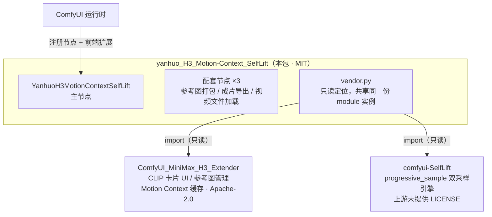
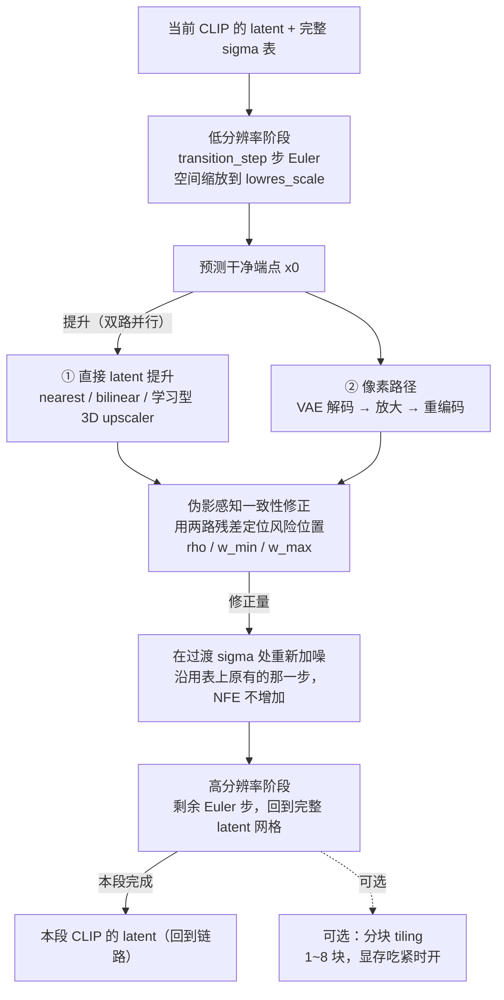
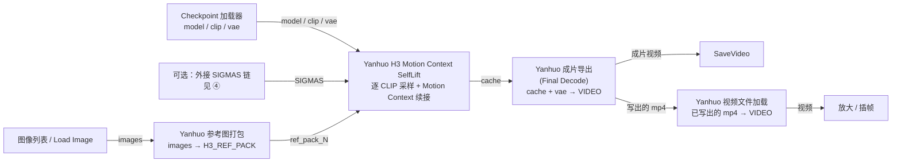
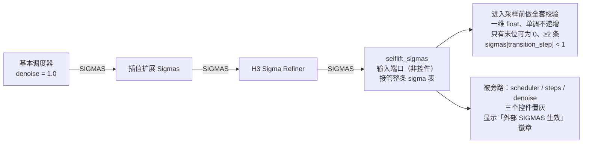
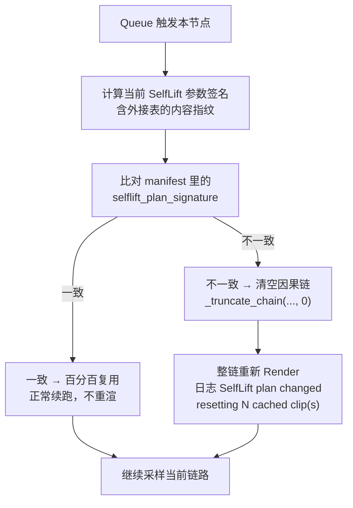
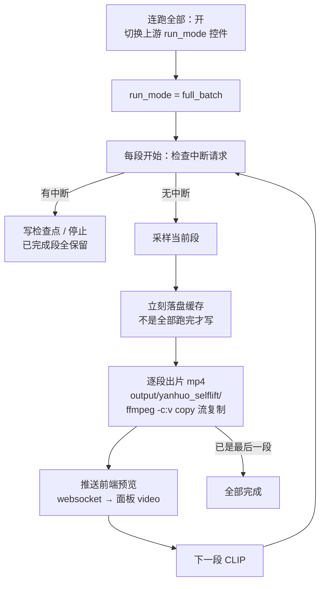

# 工作原理图

本插件的 6 张原理图。**同一份内容提供两种形式**：

- **Mermaid**（本文件内，GitHub 原生渲染，可复制进任意支持 Mermaid 的地方）
- **SVG**（[`docs/images/`](images/)，可直接下载、贴进文档/PPT）

| # | 图 | SVG |
|---|---|---|
| ① | 架构与依赖边界 | [`01-architecture.svg`](images/01-architecture.svg) |
| ② | 单段 CLIP 的双分辨率采样管线 | [`02-sampling-pipeline.svg`](images/02-sampling-pipeline.svg) |
| ③ | ComfyUI 工作流接线 | [`03-workflow-wiring.svg`](images/03-workflow-wiring.svg) |
| ④ | 外接 SIGMAS 调度链 | [`04-external-sigmas.svg`](images/04-external-sigmas.svg) |
| ⑤ | 缓存一致性：什么时候会重渲 | [`05-cache-signature.svg`](images/05-cache-signature.svg) |
| ⑥ | 连跑全部与中断续跑循环 | [`06-fullbatch-loop.svg`](images/06-fullbatch-loop.svg) |

SVG 由 [`images/build_svg.py`](images/build_svg.py) 生成，改完重跑即可；
`python images/check_svg.py` 会自检越界、框重叠、连线穿透与文字溢出。

---

## ① 架构与依赖边界

要点：本包**只 import，不修改、不内置、不随包分发**这两个姊妹包。
缺任一个 → 打日志并跳过节点注册，ComfyUI 照常启动。

---

## ② 单段 CLIP 的双分辨率采样管线

Motion Context **全程不变**：conditioning 仍带 `minimax_keyframes` 与 `minimax_refs`，
latent 仍是 nested AV latent，音频仍走复用 Euler 边界步 —— 时间连续性完整保留。

关闭 `selflift_enabled` 时整条管线被跳过，等同原 Extender 单阶段采样。

---

## ③ ComfyUI 工作流接线

参考图端口只有逐片段的 `ref_pack_N` / `prompt_N` / `ref_audio_N_x`——接哪个片段就只影响哪个片段。
主节点本身不吐视频：`cache` 只是链路缓存，成片必须过 Final Decode。

---

## ④ 外接 SIGMAS 调度链

`transition_step` 变为**外部表中的切割索引**：低分辨率阶段用表前 `transition_step+1` 个点。

确认是否生效看三处：徽章是否亮 / INFO 日志「采样调度来源」/ 报错里那句 `resolved from ...`。

---

## ⑤ 缓存一致性：什么时候会重渲

参数、语义桥、外接表链任一变化都会进签名；关闭语义桥时签名与开启前完全一致，不会白白重渲一次。
三条链路（Ref2VA 运动链 / Ref2VA 独立瑞 / FL2VA）都接了；某条路径解析失败只打 WARNING，不中断生成。

---

## ⑥ 连跑全部与中断续跑循环

连跑**不会**自动勾「已校验」——与手工流程一致，不会替你接受未审片的片段。

「停在当前段」= 当前段跑完、检查点落盘后停下，下次 Queue 从断点续跑；
ComfyUI 硬 Interrupt 则是立即中断、当前段作废。
